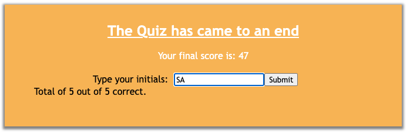
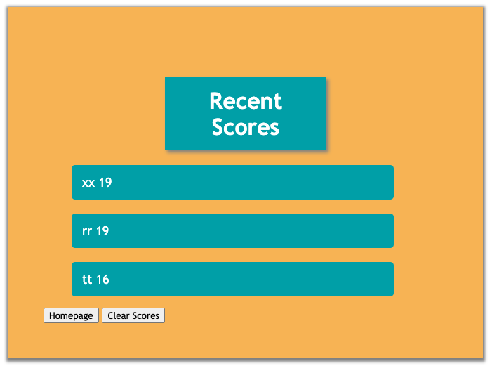

# Test Your Coding Knowledge

## Description

[Link to deployed site] (https://jonnyboy808.github.io/test-your-js-knowledge/)

Ready to get to test your coding knowledge in a fun and interacting way? Give this short 5 question test a chance. You are taken through a series of questions with at least 4 questions to choose from. Whether you choose correctly or not you still move to the next set of questions. This quiz has no limits to how many times you can take it so feel free to play it over and over again until you have mastered it.

## Installation

No type of installation needed for this application, simply visit the above link and follow the prompts to start testing your knowledge.

## Usage

You may use this as a quick and easy way to interact and test your knowledge. With each question answered you are taken to the next set of questions until you have either answered all questions correctly, or if you run out of time. Take note that with each wrong answer you are deducted 10 seconds from the timer which is originally set to 60 seconds. If you run out of time, the test will come to an end. Once reaching the end you may enter your initials to be displayed on the running scores page. The scores page may be viewed from the starter page as well. The scores page allows you to return back to the starter page or clear out any exsisting scores.

Below is an example of what to expect from the starter page.

When the quiz has come to an end you are met with the follow message from the image below showing you your final score and how many questions you answered correctly. 

---
Lastly, below is an example of the recent scores page that displays when you either complete the quiz and hit the submit button, or if you click the "View Scores" link from the top of the homepage

Get ready to test your knowledge!

## Credits

N/A

## License

No license at this time

---
